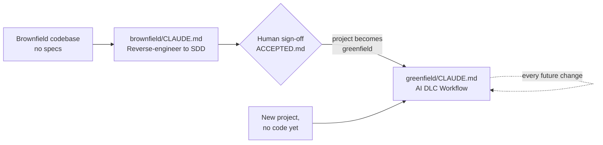

# AI-DLC
Keep all info related to AI DLC

## Brownfield Projects.
Converting an undocumented, legacy brownfield software project into a highly disciplined, Spec-Driven Development (SDD) architecture using Claude Code requires a "planning-first" framework.
The code already exists, specs are missing or outdated, and adopting SDD feels almost impossible. That’s why we need Reverse-Spec.

## ai-dlc-workflow/: two starting points, one workflow

`ai-dlc-workflow/` has two subfolders — pick the one that matches where the project is today. `brownfield/` is a **one-time** on-ramp: run it once, and the project **becomes** greenfield. `greenfield/` is the standing workflow every project — one that started that way, or one that just finished the brownfield on-ramp — follows for every change from then on.

Both write into `/ai-dlc/` in the target repo — a visible, top-level folder, deliberately not hidden: these are real team-facing documents (business rules, stories, requirements), meant to be browsed and edited by the whole team, not AI-tooling config nobody but Claude touches. Also deliberately not `/specs/`: that name collides with the test-spec directory convention many stacks already use (RSpec's `spec/` in Ruby, some Jest/Jasmine setups). Because everything — a story's status, its full technical detail, its task list — lives in these checked-in files rather than in any one developer's local session, any team member can pick up a `Not Started` or paused `In Progress` story exactly where someone else left it. Shape of `/ai-dlc/` in a target repo, once both stages have run at least once:

```
ai-dlc/
  architecture.md         — baseline docs: permanent, updated in place as the project evolves
  domain-model.md
  business-rules.md
  constitution.md
  stories.md              — the ledger: every story's full entry (business + technical detail), old and new
  test-coverage.md
  ACCEPTED.md
  learnings.md            — append-only
  requests/               — per-change intake files; archival once every story they produced is Done
    <change-name>.md
    <bug-name>.md
```



### `ai-dlc-workflow/brownfield/` — one-time conversion

Use this only if the project already has code and no specs. Copy `brownfield/CLAUDE.md` into the target repo's root as `CLAUDE.md`, then run `brownfield/reverse-engineering-baseline.md` step by step to produce `/ai-dlc/` — the six baseline docs listed below (canonical list: `reverse-engineering-baseline.md` Step 10). Optionally run `brownfield/business-context-narrowing.md` to sharpen the reverse-engineered stories with real business context. This ends only when you've reviewed the baseline and signed it off with `/ai-dlc/ACCEPTED.md` — at that point the project **is** a greenfield project, permanently, and there's no reason to come back to this folder.

The six baseline docs: `architecture.md`, `domain-model.md`, `business-rules.md`, `constitution.md`, `stories.md`, and `test-coverage.md`.

### `ai-dlc-workflow/greenfield/` — the standing workflow

Use this from day one on a genuinely new project, or the moment `brownfield/` above finishes. Copy `greenfield/CLAUDE.md` into the repo's root as `CLAUDE.md` (replacing the brownfield one, if there was one). From here on it governs every enhancement and bug fix: check `/ai-dlc/learnings.md` and the baseline first, then capture the request in a single intake file (`/ai-dlc/requests/<change-name>.md`). Claude analyzes it in Plan Mode, scopes it into one story or an ordered list of smaller ones, and drafts each story's full entry — business format plus technical detail (design, tasks) — directly into `/ai-dlc/stories.md`, tagged `Status: Not Started | In Progress | Done`. Once approved, stories are implemented one at a time; the intake file becomes archival once every story it produced is `Done`. Bug fixes use a lighter variant with their own intake file. Update the baseline and learnings log after.

## Contents

```
ai-dlc-workflow/
  brownfield/                              — one-time: run only if the project has no specs yet
    CLAUDE.md                              — copy to target repo root to start
    reverse-engineering-baseline.md        — the step-by-step sequence; builds /ai-dlc/ and signs it off
    business-context-narrowing.md          — optional: sharpen stories with business context
  greenfield/                              — standing workflow for every project, from day one or post-conversion
    CLAUDE.md                              — copy to repo root; governs every future change
  templates/                               — optional intake-file skeletons for greenfield/
    enhancement-request.md                 — /ai-dlc/requests/<change-name>.md; Claude drafts the story(ies) from it
    bug-request.md                         — /ai-dlc/requests/<bug-name>.md, for the lightweight bug-fix variant
```

- **`ai-dlc-workflow/brownfield/CLAUDE.md`** — Rule 0 (ask before assuming) plus the instruction to run `reverse-engineering-baseline.md`. Nothing about ongoing feature work lives here — that's `greenfield/`'s job, once this is done.
- **`ai-dlc-workflow/brownfield/reverse-engineering-baseline.md`** — the ordered, copy-pasteable prompt sequence to run once against any existing codebase to produce the six baseline docs (see above — this file's Step 10 is the canonical list) under `/ai-dlc/`, ending in an explicit sign-off (`ACCEPTED.md`).
- **`ai-dlc-workflow/brownfield/business-context-narrowing.md`** — optional follow-up to prioritize and clarify the reverse-engineered stories using real product/business context. Skip if not available.
- **`ai-dlc-workflow/greenfield/CLAUDE.md`** — the rules read at the start of every session: Rule 0, the baseline reference (handles both "author it fresh" for a new project and "go run brownfield/ first" for an unconverted one), the ongoing spec-first workflow, the lightweight bug-fix variant, and the learnings log.
- **`ai-dlc-workflow/templates/`** — optional starting-point skeletons for the single-file intake docs `greenfield/CLAUDE.md` describes: `enhancement-request.md` (becomes `/ai-dlc/requests/<change-name>.md`) and `bug-request.md` (becomes `/ai-dlc/requests/<bug-name>.md`). Claude drafts the resulting story or stories directly into `/ai-dlc/stories.md`, not into a separate file. Not required — skip a section that doesn't apply rather than leaving placeholder text in a real spec doc.

## How to apply this to a project

**If the project already has code and no specs (brownfield) — one-time:**
1. Copy `ai-dlc-workflow/brownfield/CLAUDE.md` into the root of the target repo as `CLAUDE.md` (alongside the rest of `brownfield/`, or referenced from wherever your team keeps shared docs).
2. Open Claude Code in that repo.
3. Work through `reverse-engineering-baseline.md`, step by step, in order — paste each step's prompt as-is. It ends with your sign-off, creating `/ai-dlc/ACCEPTED.md`.
4. (Optional) Run `business-context-narrowing.md` any time after Step 8 of the baseline sequence, before the final sign-off.
5. Copy `ai-dlc-workflow/greenfield/CLAUDE.md` over the repo's root `CLAUDE.md`. The project is now greenfield — permanently — and step 4 above never needs to run again.

**If the project is new, or just finished the steps above:**
6. `ai-dlc-workflow/greenfield/CLAUDE.md` (already in place) governs every enhancement and bug fix from here on — including checking `/ai-dlc/learnings.md` first and updating the baseline after every change.

## Principle behind Rule 0

The single most important rule in both `CLAUDE.md` files is the first one: **ask before assuming, on anything, always.** Every other part of this process — the baseline being trustworthy, the specs staying in sync with code, the learnings log being accurate — depends on Claude asking instead of guessing whenever something is unclear. Teams adopting this playbook should not weaken or remove Rule 0.
