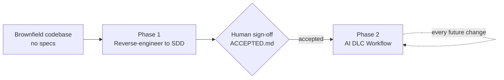

# AI-DLC
Keep all info related to AI DLC

## Brownfield Projects.
Converting an undocumented, legacy brownfield software project into a highly disciplined, Spec-Driven Development (SDD) architecture using Claude Code requires a "planning-first" framework.
The code already exists, specs are missing or outdated, and adopting SDD feels almost impossible. That’s why we need Reverse-Spec.

## Two Phases

This framework brings a project into disciplined, spec-driven AI development in two broad phases: a one-time conversion, then a standing workflow for everything after.



### Phase 1 — Brownfield → SDD (one-time, AI-assisted)

Run `playbook/reverse-engineering-baseline.md` step by step against the existing codebase to produce `/specs/baseline/`: `architecture.md`, `domain-model.md`, `business-rules.md`, `constitution.md`, `stories.md`, and `test-coverage.md`. Optionally run `playbook/business-context-narrowing.md` to sharpen the reverse-engineered stories with real business context. Phase 1 ends only when you've reviewed the baseline and it's signed off with `/specs/baseline/ACCEPTED.md` — that file is the gate into Phase 2.

### Phase 2 — AI DLC Workflow (ongoing, every future change)

Once the baseline is accepted, `CLAUDE.md`'s spec-first workflow governs every enhancement and bug fix from here on: check `/specs/learnings.md` and the baseline first, then go through `requirements.md → design.md → tasks.md → implementation` (or the lightweight bug-fix variant for small fixes), then update the baseline and learnings log after. This is the same loop a greenfield project would use from day one — Phase 1 is what earns a brownfield project the right to join it.

## Contents

```
CLAUDE.md                                  — drop into any project's root; governs Phase 2
playbook/
  reverse-engineering-baseline.md          — Phase 1: build /specs/baseline/ and sign it off
  business-context-narrowing.md            — optional, within Phase 1: sharpen stories with business context
```

- **`CLAUDE.md`** — the standing rules Claude Code reads at the start of every session in a project: the forced ask-before-assuming rule (Rule 0), the baseline reference, the Phase 2 spec-first workflow, the lightweight bug-fix variant, and the learnings log.
- **`playbook/reverse-engineering-baseline.md`** — Phase 1: the ordered, copy-pasteable prompt sequence to run once against any existing codebase to produce `architecture.md`, `domain-model.md`, `business-rules.md`, `constitution.md`, `stories.md`, and `test-coverage.md` under `/specs/baseline/`, ending in an explicit sign-off (`ACCEPTED.md`) before Phase 2 begins.
- **`playbook/business-context-narrowing.md`** — optional Phase 1 follow-up to prioritize and clarify the reverse-engineered stories using real product/business context. Skip if not available.

## How to apply this to a project

**Phase 1 — one-time conversion:**
1. Copy `CLAUDE.md` into the root of the target repo (alongside this playbook, or referenced from wherever your team keeps shared docs).
2. Open Claude Code in that repo.
3. Work through `playbook/reverse-engineering-baseline.md`, step by step, in order — paste each step's prompt as-is. It ends with your sign-off, creating `/specs/baseline/ACCEPTED.md`.
4. (Optional) Run `playbook/business-context-narrowing.md` any time after Step 8 of the baseline sequence, before the final sign-off.

**Phase 2 — from here on, every change:**
5. Every enhancement or bug fix in that repo now automatically follows the spec-first workflow defined in `CLAUDE.md` — including checking `/specs/learnings.md` first and updating the baseline after every change.

## Principle behind Rule 0

The single most important rule in `CLAUDE.md` is the first one: **ask before assuming, on anything, always.** Every other part of this process — the baseline being trustworthy, the specs staying in sync with code, the learnings log being accurate — depends on Claude asking instead of guessing whenever something is unclear. Teams adopting this playbook should not weaken or remove Rule 0.
